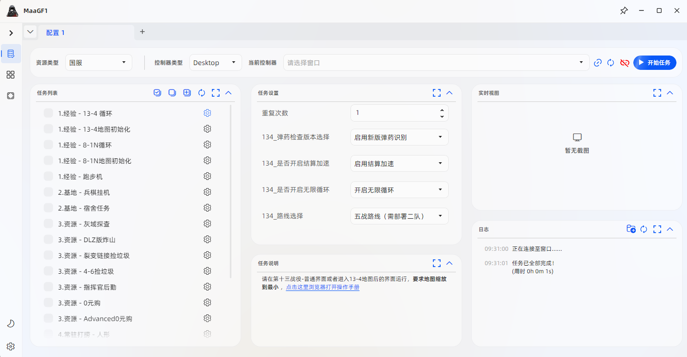

# 下载并运行 2.0

&emsp;&emsp;本篇文章用于介绍MaaGF1在`v2.0.0`之后的版本中的下载、使用方式。

## 一、下载

### 1.1 基础说明

&emsp;&emsp;在[releases](https://github.com/MaaGF1/MaaGF1/releases)页面中包含了历史发行版本，其中：

1. `latest`标签表示该发行包为**稳定版**，功能相对稳定；
2. `Pre-release`标签表示该发行包为**预览版**，包含测试功能。

### 1.2 Release页面介绍

&emsp;&emsp;以[latest](https://github.com/MaaGF1/MaaGF1/releases/latest)为例，页面主要包含如下内容：

1. **标题**
    - 稳定版标题一般为`Operation Cube .I`、`Singularity .II`等，其含义对应《少女前线》的各项战役，如“魔方行动”、“坍塌点”；
    - 预览版标题一般为`v2.0.0-alpha.2`、`v2.0.0-beta.1`等，主要用作集成、测试使用，其中`alpha`稳定性相对`beta`更差。
2. **正文**
    - 第一行包含了具体的`tag`和日期，用于确定具体的版本，如：`2.0.0-alpha.2 (2026-03-10)`；
    - 其他章节包含了如下的信息：`集成`、`新增`、`修复`、`优化`等内容，用于提示版本更新内容；
    - 最后一行一般以`Changelog`结尾，包含两次release之间的diff信息。
3. **Assets**
    - 在最下方的`Assets`一栏中，包含了MaaGF1的GUI(MFA)运行版，其中：
    - 命名规则为：`MaaGF1-GUI-vA.B.C-ARCH(-Agent).zip`；
        * `vA.B.C`对应版本编号，例如`v2.0.0`；
        * `ARCH`为运行平台架构，仅支持`aarch64`或`x86-64`；
        * 操作系统仅发布`Windows`，暂未集成`Linux`和`OS X`；
        * `Agent`后缀表示启用了MaaFramework Agent的版本，部分任务需要依赖此项功能。
    - 最后的`MaaGF1-Resource-vA.B.C.zip`为**资源包**，可以同于`vA.B.*`之间的轻量化更新，而无需删除、重新下载整包。

&emsp;&emsp;因此，下载`MaaGF1-GUI`只需要：

1. 寻找对应版本的Release；
2. 在Assets一栏中下载对应架构、功能的`zip`文件即可。

### 1.3 Agent

&emsp;&emsp;当前，依赖于`-Agent`的任务有：

1. Ad零元购。

## 二、运行

&emsp;&emsp;下载`*.zip`压缩包并解压后，运行其中的`MFAAvalonia.exe`，该程序有如下依赖：

1. `.Net Runtime` &gt; 10.0
2. `VC++` &gt; 14.4

> 在`1.8`之后，`MFAAvalonia`在根目录下添加了一键安装依赖的脚本，`DependencySetup_依赖库安装_win.bat`。

&emsp;&emsp;运行`MFAAvalonia`后，其界面如下：

&emsp;&emsp;在`MFAAvalonia`中存在多个子窗口：

1. **资源类型**：目前支持国服和美服；
2. **控制器类型**：目前仅支持桌面端(Win32)；
3. **当前控制器**：用于选择游戏窗口；
4. **任务列表**：用于选择MaaGF1中的不同脚本；
5. **任务设置**：用于选择**任务列表**中的脚本子选项，例如选择不同打捞人形等；
6. **任务说明**：关于**任务列表**中所选脚本的简要说明；
7. **实时视图**：用于预览MaaFramework捕获到的图片，可以在设置中关闭；
8. **日志**：用于查看`MaaFw`或`Agent`的日志信息。

## 三、设置

### 3.1 游戏中的设置

&emsp;&emsp;MaaGF1要求游戏配置如下：

1. 窗口模式、`1280x720`；
2. 记录上次完成关卡时镜头缩放；
3. **不要**最小化游戏窗口。

### 3.2 如何运行脚本

&emsp;&emsp;以`DLZ版炸山`为例：

1. 勾选`3.资源 - DLZ版炸山`；
2. 选择`重复次数`，其中`-1`表示**无限次重复**；
3. 其他配置参考相关文档。

### 3.3 MaaGF1-GUI的设置

&emsp;&emsp;在`v2.0.0`，即`MFAAvalonia 2.10.8`之后添加了如此的设置：

- 运行设置
    1. 如不需要调试信息，可以关闭`截图保存`功能；
    2. 如需要节省CPU资源，可以关闭`实时视图`功能。
- 连接设置
    1. 默认采用`PrintWindow`、`SendInput(Seize)`；
    2. 如果要使用**后台点击**，请选择`鼠标输入&键盘输入`为`PostMessageWithWindowPos`，同时可以将窗口放到`桌面 2`或其他位置。
- 资源更新
    1. `MaaGF1/MFAAvalonia`默认屏蔽了全部的更新功能；
    2. `资源更新`和`重新下载资源全量包`被替换为了`MaaGF1`中的`./tools/nadia/updater.ps1`，通过Powershell的`wget`实现同版本轻量化更新。